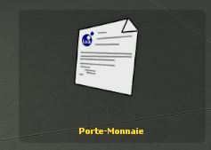
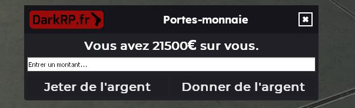
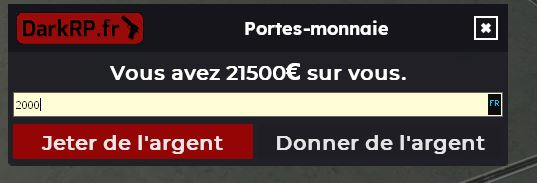

# **DarkRP.fr -Wallet**

## **Le projet 📢**

Système de wallet pour mon serveur DarkRP.fr sur le jeu Garry's mod.

Porte monnaie simple comme swep avec interface pour remplacer les commandes du mode de jeu DarkRP

Clic droit ou gauche pour utiliser le swep et avoir l'interface.

## **Les prérequis 📍**

Le jeu Garry's mod ainsi qu'un serveur local ou publique avec le mode de jeu DarkRP d'installer.

DarkRP : https://github.com/FPtje/DarkRP

## **Installation ▶️**

Tout d'abord télécharger ou forker le projet au complet pour avoir l'ensemble des fichiers.

Dans votre serveur dans le dossier addons veuillez créer un dossier que vous nommerez par exemple "portemonnaie" et 
dedans mettre l'ensemble du contenu présent dans ce dépôt.

## **Configuration ⚙️**

Dans lua/autorun/sh_wallet.lua

Vous pouvez modifier la langue et desactiver ou non le porte monnaie

> Credit : SlownLS, enzoFR60, la_ref(me)
